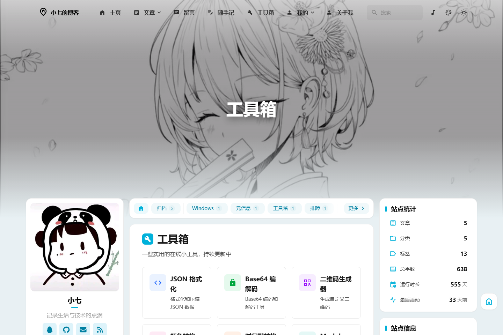
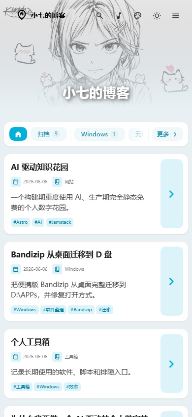

# 小七的博客

一个用 Astro 构建的个人博客与数字花园，用来记录工具折腾、Windows 排障、AI 工作流、随手笔记和个人兴趣内容。

<p align="center">
  <a href="https://277.bbroot.com">在线访问</a>
  ·
  <a href="https://github.com/qiqiqi-max/xiaoqi-blog">GitHub 仓库</a>
  ·
  <a href="https://277.bbroot.com/tools/">工具箱</a>
</p>

<p align="center">
  
  
  
  
</p>

## 项目预览

### 首页


### 工具箱



### 移动端

<p align="center">
  
</p>

## 项目简介

这个博客不是一个单纯的模板展示页，而是我自己长期使用和维护的个人站点。它把正式文章、随手笔记、工具箱、动态壁纸、音乐播放器和追番记录整合在一起，适合作为个人数字花园、知识库和作品展示入口。

目前站点主要记录这些内容：

- Windows 软件迁移、系统排障和日常折腾记录
- AI 工具、效率工具和个人工作流整理
- 个人数字花园建设过程
- 随手记、小想法和临时笔记
- 自用工具箱与常用入口
- 追番、番组和兴趣内容展示

## 功能亮点

### 内容与写作

- 支持 Markdown / MDX 写作
- 支持文章分类、标签、归档、置顶和 RSS
- 支持独立的「随手记」短笔记入口
- 支持 Pagefind 静态全文搜索
- 支持代码高亮、数学公式、提示块和文章目录

### 视觉与交互

- 首页动态壁纸轮播，桌面端和手机端分别适配
- 支持亮色、暗色、跟随系统和主题色切换
- 支持 Swup 页面过渡
- 支持响应式布局，桌面端双侧栏，移动端单列阅读
- 头像、公告、站点统计、站点信息、分类、标签等侧边栏组件可配置

### 音乐与工具

- 本地音乐播放器，支持导航栏弹窗和左侧栏播放控件
- 本地 JSON 歌单配置，音乐文件可直接放在 `public/assets/music/`
- 独立「工具箱」页面，后续可以继续扩展 JSON、Base64、二维码、时间戳等在线工具

### 个人兴趣页面

- 追番页面
- Bangumi 番组记录页面
- 留言板页面
- 关于我页面

## 技术栈

| 类型 | 技术 |
| --- | --- |
| 框架 | Astro 7 |
| 语言 | TypeScript |
| 样式 | Tailwind CSS 4 |
| 内容 | Astro Content Collections、Markdown、MDX |
| 交互 | Svelte Islands、Swup、原生浏览器 API |
| 搜索 | Pagefind |
| 图标 | Iconify、Astro Icon |
| 部署 | Cloudflare Pages |
| 包管理 | pnpm |

## 项目结构

```text
src/
  components/          页面组件、侧边栏组件、播放器组件等
  config/              站点、导航栏、侧边栏、音乐、壁纸等配置
  content/
    posts/             正式博客文章
    notes/             随手记
    spec/              about、guestbook 等特殊页面内容
  layouts/             页面布局
  pages/               路由页面，包括 tools、notes、archive 等
public/
  assets/
    music/             本地音乐文件
    wallpapers/        桌面端和手机端壁纸
  data/
    music-playlist.json 本地音乐歌单
scripts/               构建辅助脚本
```

## 快速开始

安装依赖：

```bash
pnpm install
```

启动开发服务器：

```bash
pnpm run dev
```

构建静态站点：

```bash
pnpm run build
```

预览构建结果：

```bash
pnpm run preview
```

## 常用命令

```bash
# 新建博客文章
pnpm run new-post -- "文章标题"

# Astro 检查
pnpm run check

# 格式化源码
pnpm run format

# 代码检查
pnpm run lint

# 生成图标常量
pnpm run icons

# 生成图片 LQIP 缓存
pnpm run lqips
```

## 写文章

正式文章放在：

```text
src/content/posts/
```

随手记放在：

```text
src/content/notes/
```

文章 frontmatter 示例：

```yaml
---
title: 文章标题
published: 2026-07-09
description: 简短描述
image: ''
tags: [工具箱, Windows]
category: 工具箱
draft: false
lang: zh_CN
---
```

随手记 frontmatter 示例：

```yaml
---
title: 一条随手记
published: 2026-07-09
description: 简短摘要
tags: [记录]
draft: false
---
```

## 自定义壁纸

壁纸配置：

```text
src/config/backgroundWallpaper.ts
```

壁纸文件：

```text
public/assets/wallpapers/
public/assets/wallpapers/mobile/
```

当前站点使用桌面端和手机端两套动图资源，并开启轮播。替换同名文件或修改配置里的图片列表即可更新壁纸。

## 自定义音乐

音乐文件：

```text
public/assets/music/
```

歌单配置：

```text
public/data/music-playlist.json
```

示例：

```json
{
  "playlist": [
    {
      "name": "夜、萤火虫和你",
      "artist": "AniFace",
      "url": "/assets/music/aniface-night-fireflies-and-you.mp3"
    }
  ]
}
```

## 部署

当前项目通过 GitHub 仓库连接 Cloudflare Pages 部署。推送到 `main` 分支后，Cloudflare Pages 会自动构建并发布。

Cloudflare Pages 构建配置：

```text
Build command: pnpm run build
Build output directory: dist
Node.js version: 18 或更高
```

当前自定义域名：

```text
277.bbroot.com
```

## 后续计划

- 继续补充工具箱里的实用在线工具
- 优化随手记的展示方式
- 增加更多个人工作流和工具整理文章
- 持续打磨移动端壁纸和阅读体验

## 版权说明

本仓库代码可作为 Astro 静态博客搭建参考。站点中的文章内容、截图、图片、音乐资源和个人素材主要用于个人展示与备份，未经允许请勿直接搬运。
